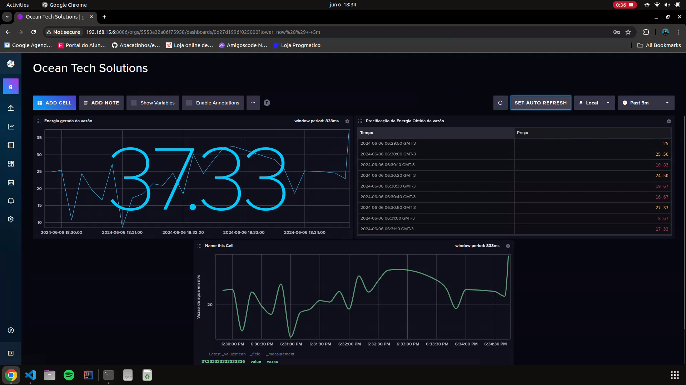

## MQTT-Broker com Docker, MQTT, Grafana, InfluxDB, Python e ESP32

Esse projeto é nada mais, nada menos que uma descoberta que fiz no meio do evento da global solution da FIAP. Eu já tinha curiosidade para utilizar o grafana em outros projetos, e nesse de fato ele foi bem aproveitado. Junto a ele, utilizei o InfluxDb, que nada mais é que um banco de dados utilizado para trabalhar em séries temporais. A ideia é: 

* Um dispositivo arduino (ESP32) emite um evento MQTT para um servidor mosquitto. Como a ideia do projeto é simular uma gestão de resíduos e energia, eu utilizei números ficticios para representar os dados capturados dos sensores. 
* Um script Python ouvirá o evento MQTT em meu Raspberry Pi (Que estará atuando como middleware) e persistirá o valor para o InfluxDB.
* E de acordo com os dados capturados e armazenados no Influx, vou fazer o monitoramento desses dados com o Grafana.

### Servidor
Aqui utilizaremos 3 servidores:
* MQTT server (mosquitto)
* InfluxDB server
* Grafana server

Usaremos o Docker. Eu tenho um host Docker rodando em um Raspberry Pi3. O Raspberry Pi é um dispositivo ARM, portanto, precisamos de imagens docker para esta arquitetura.
```yml
version: '2'
services: 
  mosquitto:
    image: pascaldevink/rpi-mosquitto
    container_name: mosquitto
    ports:
      - "1883:1883"
    restart: always

  influxdb:
    image: influxdb:2
    container_name: influxdb2
    restart: always
    environment:
      - DOCKER_INFLUXDB_INIT_MODE=setup
      - DOCKER_INFLUXDB_INIT_USERNAME=admin
      - DOCKER_INFLUXDB_INIT_PASSWORD=admin
      - DOCKER_INFLUXDB_INIT_ORG=globalsolution
      - DOCKER_INFLUXDB_INIT_BUCKET=iot
      - INFLUXDB_HTTP_AUTH_ENABLED=true
      - DOCKER_INFLUXDB_INIT_ADMIN_TOKEN=
    ports:
      - "8086:8086"
    volumes:
      - influxdb2-data:/var/lib/influxdb2
      - influxdb2-config:/etc/influxdb2

  grafana:
    image: fg2it/grafana-armhf:v4.6.3
    container_name: grafana
    restart: always
    environment:
      - GF_SECURITY_ADMIN_USER=admin
      - GF_SECURITY_ADMIN_PASSWORD=admin
    ports:
      - "3000:3000"
    volumes:
      - grafana-db:/var/lib/grafana
      - grafana-log:/var/log/grafana
      - grafana-conf:/etc/grafana

volumes:
  grafana-db:
    driver: local
  grafana-log:
    driver: local
  grafana-conf:
    driver: local
  influxdb2-data:
    driver: local
  influxdb2-config:
    driver: local
```

### ESP32
A parte do Esp32 é muito simples. Caso você queria experimentar com sensores, basta conectar no esp, configurar no void setup, receber os dados via analogRead, e enviar os dados no mqttEmit.
Precisamos também configurar nossa rede Wifi e conectar-nos ao nosso servidor MQTT.

```c
#include <WiFi.h>
#include <PubSubClient.h>

//Case de exemplo:
const float densidade = 1000.0; // Densidade da água em kg/m³
const float gravidade = 9.81; // Aceleração da gravidade em m/s²
int vazao; // Vazão em m³/s - O valor seria substituído pelo sensor;
const float altura = 10.0; // Altura da queda d'água em metros - 10 metros - O valor seria substituído pelo sensor;
float eficiencia; // Eficiência do sistema (valor entre 0 a 100%) - 85% 
float energia_acumulada; // Potência hidráulica em watts


// Configuração do WIFI
const char* ssid = "";
const char* password = "";


// Configuração do MQTT
const char* server = "";
const char* topic_energy = "/energy";
const char* topic_vazao = "/vazao";
const char* topic_price = "/price";
const char* clientName = "globalsolution";

String payload;

WiFiClient wifiClient;
PubSubClient client(wifiClient);

void wifiConnect() {
  Serial.println();
  Serial.print("Connecting to ");
  Serial.println(ssid);

  WiFi.begin(ssid, password);

  while (WiFi.status() != WL_CONNECTED) {
    delay(500);
    Serial.print(".");
  }
  Serial.println("");
  Serial.print("WiFi connected.");
  Serial.print("IP address: ");
  Serial.println(WiFi.localIP());
}

void mqttReConnect() {
  while (!client.connected()) {
    Serial.print("Attempting MQTT connection...");
    if (client.connect(clientName)) {
      Serial.println("connected");
    } else {
      Serial.print("failed, rc=");
      Serial.print(client.state());
      Serial.println(" try again in 5 seconds");
      delay(5000);
    }
  }
}

void mqttEmit(String topic, String value)
{
  client.publish((char*) topic.c_str(), (char*) value.c_str());
}

void setup() {
  Serial.begin(115200);
  randomSeed(analogRead(0));
  wifiConnect();
  client.setServer(server, 1883);
  delay(1500);
}

void loop() {
  if (!client.connected()) {
    mqttReConnect();
  }

  //Calculo de energia
  int efficiencyPercentage = random(80, 90); 
  eficiencia = efficiencyPercentage / 100.0;
  vazao = random(2 , 10);
  energia_acumulada = round((densidade * gravidade * vazao * altura * eficiencia)) / 10;

  float energia_kWh = energia_acumulada / 1000.0; // Converter watts para kilowatts
  float custoEnergia = energia_kWh * 0.40773;
  int new_energia = round(energia_kWh);
  int new_custo = round(custoEnergia);

/*
  Serial.print("O valor de energia em kW: ");
  Serial.println(new_energia);
  Serial.print("Vazão em m/s: ");
  Serial.println(vazao);
  Serial.print("Precificação da energia gerada: R$");
  Serial.println(new_custo);
*/
  mqttEmit(topic_energy, (String) new_energia);
  mqttEmit(topic_vazao, (String) vazao);
  mqttEmit(topic_price, (String) new_custo);

  delay(5000);
}
```  

### Mqtt listener
O ESP32 vai emitir 3 eventos [1- energy / 2- vazao / 3- price] com os valores dos dados simulados. Então, vamos criar um ouvinte MQTT que escuta mqtt e transfere o valor para o InfluxDB
```python
import paho.mqtt.client as mqtt
from influxdb_client import InfluxDBClient, Point, WriteOptions
import datetime
import logging

# .env example constants: 
# Constants for InfluxDB
INFLUXDB_URL = ''
INFLUXDB_TOKEN = ''
INFLUXDB_ORG = 'globalsolution'
INFLUXDB_BUCKET = 'iot'

# Constants for MQTT
MQTT_BROKER = '' #Use 'localhost' or IP address of your MQTT broker
MQTT_PORT = 1883
MQTT_TOPICS = ["/energy", "/vazao", "/price"]

def setup_logging():
    """Configure logging settings."""
    logging.basicConfig(level=logging.INFO)

def create_influxdb_client():
    """Initialize and return the InfluxDB client."""
    try:
        client = InfluxDBClient(url=INFLUXDB_URL, token=INFLUXDB_TOKEN, org=INFLUXDB_ORG)
        logging.info("Connected to InfluxDB")
        return client.write_api(write_options=WriteOptions(batch_size=1))
    except Exception as e:
        logging.error(f"Error connecting to InfluxDB: {e}")
        raise

def persists(msg):
    """Persist data to InfluxDB."""
    try:
        current_time = datetime.datetime.utcnow().isoformat()
        write_points(msg.payload, current_time)
    except Exception as e:
        logging.error(f"Error writing to InfluxDB: {e}")

def write_points(payload, current_time):
    """Write points to InfluxDB."""
    value = int(payload)
    points = [
        Point("energy").field("value", value).time(current_time),
        Point("vazao").field("value", value).time(current_time),
        Point("price").field("value", value).time(current_time)
    ]
    for point in points:
        write_api.write(bucket=INFLUXDB_BUCKET, record=point)

def on_connect(client, userdata, flags, rc):
    """Callback function for MQTT connect."""
    if rc == 0:
        logging.info("Connected to MQTT broker")
        for topic in MQTT_TOPICS:
            client.subscribe(topic)
    else:
        logging.error(f"Failed to connect to MQTT broker, return code {rc}")

def on_message(client, userdata, msg):
    """Callback function for MQTT message reception."""
    logging.info(f"Received message: {msg.payload} on topic {msg.topic}")
    persists(msg)

def create_mqtt_client():
    """Initialize and return the MQTT client."""
    client = mqtt.Client()
    client.on_connect = on_connect
    client.on_message = on_message
    return client

def connect_mqtt_client(client):
    """Connect to the MQTT broker."""
    try:
        client.connect(MQTT_BROKER, MQTT_PORT, 60)
        logging.info("Connecting to MQTT broker")
    except Exception as e:
        logging.error(f"Error connecting to MQTT broker: {e}")
        raise

if __name__ == "__main__":
    setup_logging()
    write_api = create_influxdb_client()
    mqtt_client = create_mqtt_client()
    connect_mqtt_client(mqtt_client)
    mqtt_client.loop_forever()
```

E aqui temos o dashboard


